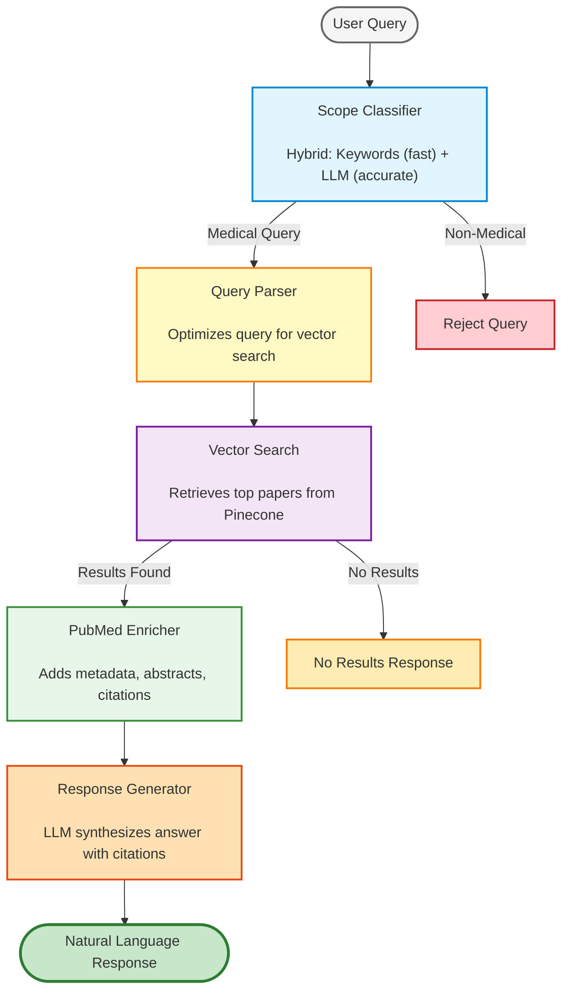

# Medical Chatbot - Take Home Task

A production-ready medical information retrieval system that combines vector search, PubMed API integration, and LLM-powered response generation to answer medical questions with cited, peer-reviewed sources.

## Overview

This system processes medical questions through a multi-stage pipeline:

1. Classifies queries to ensure they are medical in nature
2. Optimizes user queries for semantic search
3. Retrieves relevant medical literature from Pinecone vector database
4. Enriches results with PubMed metadata and citation counts
5. Generates natural language responses with inline citations

## Data Flow

The system processes queries through the following pipeline:



## Key Components

### 1. Scope Classifier (`src/nodes/scopeClassifier.ts`)

Filters non-medical queries using a hybrid approach:

- **Keyword matching** (~80% of queries, <1ms): Fast path for obvious cases
- **LLM classification** (~20% of queries, ~300ms): Handles ambiguous queries with GPT-4o-mini

**Example:**
- "What are diabetes symptoms?" → Medical (keyword match)
- "How do I bake a cake?" → Non-medical (keyword match)
- "What is T2D?" → Medical (LLM resolves ambiguity)

### 2. Query Parser (`src/nodes/queryParser.ts`)

Optimizes user queries for vector search using GPT-4o-mini:

- Removes conversational noise ("I want to know...", "My mom has...")
- Expands colloquial terms ("sugar problems" → "diabetes hyperglycemia")
- Adds medical synonyms ("tired" → "tired fatigue asthenia")
- Expands abbreviations ("T2D" → "type 2 diabetes T2D")

**Example transformation:**
```
Input:  "My mom has been feeling dizzy and tired lately"
Output: "dizzy tired dizziness fatigue vertigo symptoms causes"
```

### 3. Vector Search (`src/nodes/vectorSearch.ts`)

Retrieves relevant medical literature from Pinecone:

- Uses Google Vertex AI embeddings (768 dimensions)
- Searches against 2,063,475 indexed PubMed articles
- Returns top 5 most semantically similar papers

### 4. PubMed Enricher (`src/nodes/pubmedEnricher.ts`)

Enriches search results with PubMed metadata:

- **Fetches:** Abstracts, citation counts, journal info, article types
- **Re-ranks:** Combines vector similarity (70%) + citation count (30%)
- **APIs used:** ESummary, EFetch, ELink
- **Fallback:** Gracefully handles missing PMIDs, abstracts, or API failures

**Re-ranking formula:**
```
qualityScore = (vectorSimilarity × 0.7) + (normalizedCitations × 0.3)
```

### 5. Response Generator (`src/nodes/respond.ts`)

Generates natural language responses using GPT-4o:

- Synthesizes information from enriched papers
- Includes numbered inline citations [1], [2], [3]
- Provides sources section with citation counts
- Adds medical disclaimer
- Professional yet accessible tone

**Example response:**
```
Type 2 diabetes is characterized by insulin resistance and relative 
insulin deficiency [1]. Common symptoms include increased thirst, 
frequent urination, and unexplained weight loss [1][2]. Other symptoms 
may include fatigue, blurred vision, and slow-healing sores [2].

SOURCES:
[1] Understanding Type 2 Diabetes - JAMA (2023) | Cited by: 145 articles
[2] Clinical Management of T2DM - Diabetes Care (2024) | Cited by: 89 articles

MEDICAL DISCLAIMER:
This information is for educational purposes only...
```

## Setup

### Prerequisites

- Node.js 18+ and npm
- Google Cloud account with Vertex AI enabled
- Pinecone API access (credentials provided)
- OpenAI API key

### Installation

1. Install dependencies:
```bash
npm install
```

2. Create `.env` file with required credentials:
```env
# Pinecone (provided)
PINECONE_API_KEY="pcsk_..."
PINECONE_INDEX_NAME="pubmed-articles"

# OpenAI
OPENAI_API_KEY="sk-..."

# Google Vertex AI
GOOGLE_APPLICATION_CREDENTIALS="/path/to/service-account.json"
GOOGLE_VERTEX_AI_PROJECT="your-project-id"
GOOGLE_VERTEX_AI_LOCATION="us-central1"
```

3. Build the project:
```bash
npm run build
```

### Running the System

**LangGraph Studio (Interactive UI):**
```bash
npm run dev
```
Access at: http://localhost:2024

**Command Line Testing:**
```bash
# Run all tests
npm run test:all

# Run individual test suites
npm run test:validate    # Integration validation
npm run test:scope       # Scope classifier
npm run test:parser      # Query parser
npm run test:pubmed      # PubMed enricher
npm run test:response    # Response generation
```